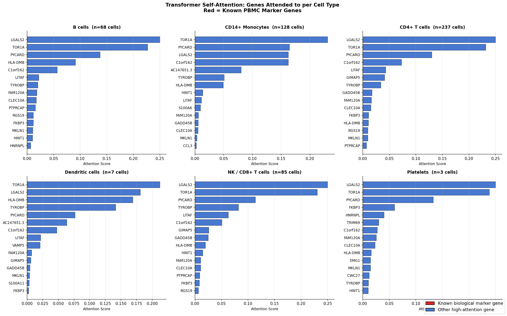
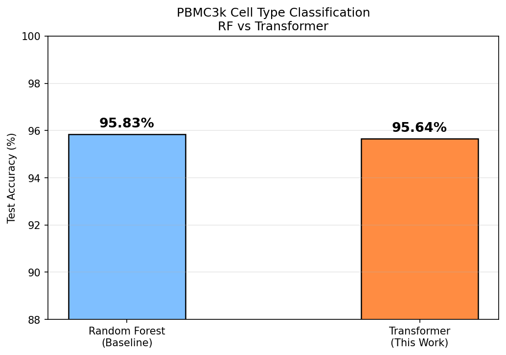

# Single-Cell RNA-seq Analysis with Transformer-Based Cell Type Annotation

Transformer-based single-cell RNA-seq analysis pipeline featuring:

- Scanpy preprocessing
- Leiden clustering
- Cell type annotation
- Transformer-based classification
- Attention visualization
- Cross-dataset transfer learning
- Comparison with Random Forest baseline

## Key Features

- Biologically interpretable Transformer attention
- PBMC3k → PBMC10k transfer experiment
- Gene-level immune representation learning
- Attention visualization for unseen datasets

## Outputs

### Attention Visualization

### Transfer Attention

### Model Comparison

